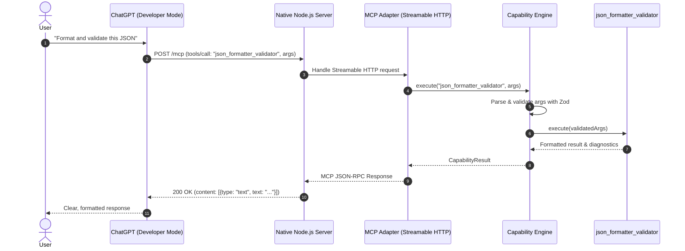

# ChatGPT Integration Architecture

## 1. Overview & Official MCP Transport

OpenAI connects ChatGPT to external developer tools using the **Model Context Protocol (MCP)** standard.

### Transport Strategy
1. **Primary & Production: Streamable HTTP (`/mcp`)**
   * ChatGPT sends JSON-RPC requests via `POST /mcp` and handles server-to-client streaming via `GET /mcp`.
   * Standardized in `@modelcontextprotocol/sdk` via `StreamableHTTPServerTransport`.
   * Hosted using native Node.js HTTP (`node:http`) without third-party frameworks like Express or Hono.
2. **Local & Testing: Stdio Transport**
   * Uses standard input/output (`process.stdin` / `process.stdout`) for zero-network testing with MCP Inspector (`@modelcontextprotocol/inspector`) and local testing.
3. **Legacy SSE Policy**:
   * Legacy dual-endpoint HTTP+SSE is deliberately omitted to keep the codebase minimal, modern, and aligned with the current official MCP standard.

---

## 2. Endpoints & Request Lifecycle

### Endpoints (Native `node:http`)
- `GET /health` — Returns JSON `{ "status": "ok", "service": "everything-free-ai-plugins" }`.
- `POST /mcp` — Handles incoming MCP JSON-RPC 2.0 messages from ChatGPT.
- `GET /mcp` — Handles MCP streaming connections.

### ChatGPT Request Lifecycle Sequence:

---

## 3. ChatGPT Setup & ₹0 Development / Deployment

### Local Development (₹0)
1. Start local server: `npm run dev` (listening on `http://localhost:3000`).
2. Expose via free tunnel (e.g. Cloudflare Quick Tunnels: `npx cloudflared tunnel --url http://localhost:3000` or ngrok free).
3. In ChatGPT:
   * Go to **Settings → Security & Login → Developer mode** (toggle ON).
   * Go to **Apps / Plugins Settings → Add App**.
   * Enter your HTTPS tunnel URL: `https://<your-tunnel-url>/mcp`.
   * Select **No Authentication**.
   * Test tool discovery and invocation in a chat.

### Production Deployment (₹0)
* Deploy to genuinely free hosting platforms (e.g., Render Free Web Service, Fly.io free tier, or Koyeb free tier) with zero credit-card requirement, or run as a free self-hosted container.
